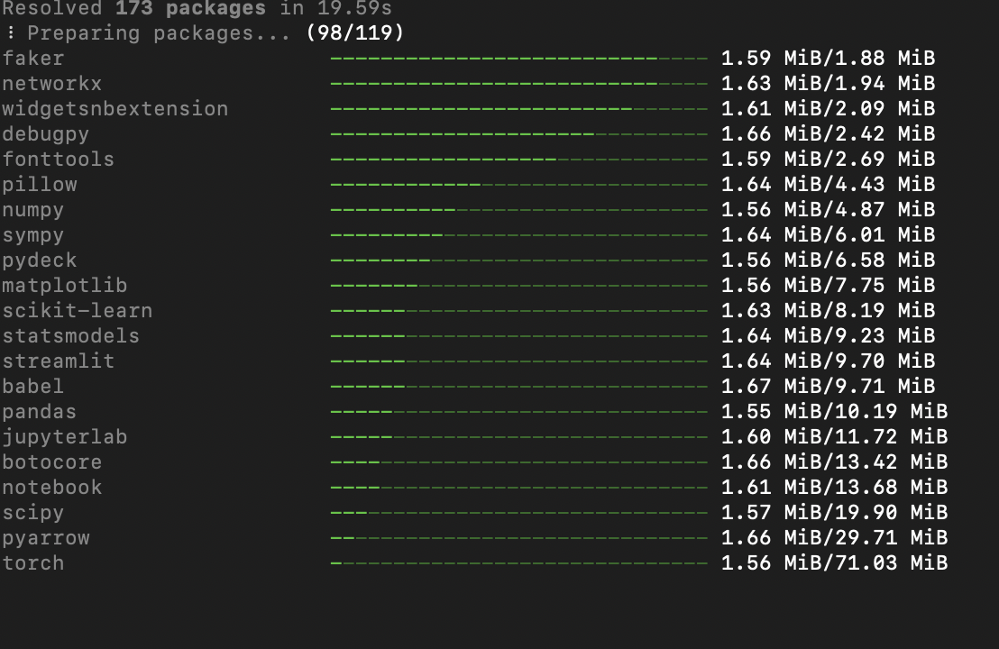
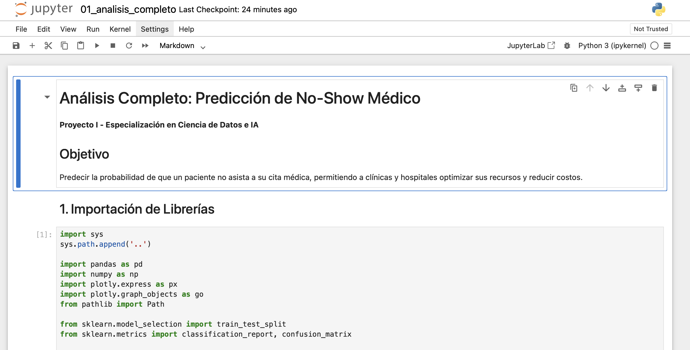
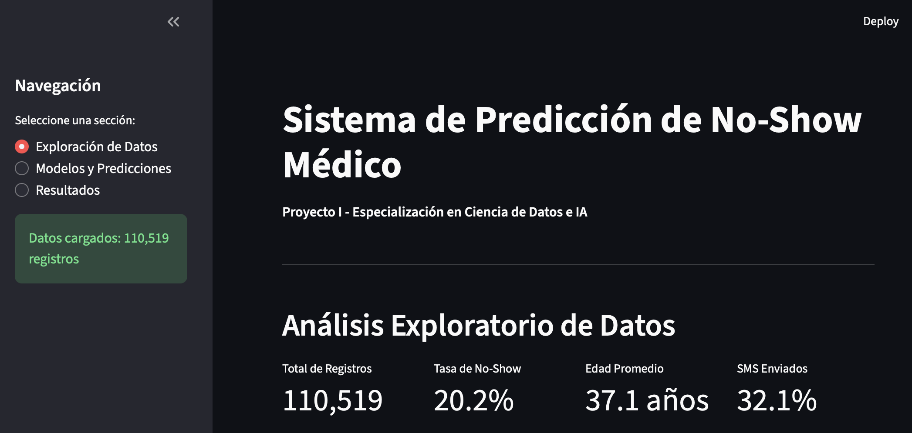

# Sistema de Predicción de No-Show Médico

**Proyecto I - Especialización en Ciencia de Datos e Inteligencia Artificial**

Sistema de Machine Learning para predecir la probabilidad de que un paciente no asista a su cita médica, permitiendo a clínicas y hospitales optimizar sus recursos y reducir costos operativos.

---

## Equipo de Desarrollo

- Diego Fernando Nuñez Diaz
- Diego Fernando Castaneda Loaiza
- Paula Carolina Barrera Camargo
- Mateo Atehortua Arango

**Universidad**: Universidad de Medellin  
**Asignatura**: Proyecto I  
**Docente**: David Palacio Jimenez

---

## Descripción del Proyecto

Este proyecto implementa un análisis completo de datos médicos utilizando técnicas de ciencia de datos y machine learning para predecir la inasistencia de pacientes a citas programadas.

### Dataset
- **Fuente**: Kaggle - Medical Appointment No Shows
- **Registros**: 110,527 citas médicas
- **Variables**: 14 características del paciente y la cita
- **Objetivo**: Predecir No-Show (0: Asistió, 1: No Asistió)

### Objetivos

Ayudar a clínicas y hospitales a:
- Reducir costos por citas perdidas
- Optimizar agendas médicas
- Mejorar la atención al paciente mediante gestión predictiva

---

## Estructura del Proyecto

```text
medical-noshow-prediction/
│
├── data/                          # Datos del proyecto
│   ├── KaggleV2-May-2016.csv     # Dataset original
│   ├── processed/                 # Datos procesados
│   └── synthetic/                 # Datos sintéticos generados
│
├── notebooks/                       # Jupyter notebooks
│   ├── 01_analisis_completo.ipynb   # Análisis principal para entrega
│   ├── 03ajuste_entrenamiento.ipynb # Entrenamiento modelo LightGBM
│   └── exploratory/                 # Notebooks de exploracion inicial
│
├── src/                           # Código fuente modular
│   ├── __init__.py
│   ├── data_loader.py            # Carga y limpieza de datos
│   ├── preprocessing.py          # Pipelines de preprocesamiento
│   ├── synthetic_data.py         # Generación de datos sintéticos (SMOTE)
│   ├── models.py                 # Entrenamiento y evaluación de modelos
│   └── visualization.py          # Visualizaciones con Plotly
│
├── app/                           # Aplicación Streamlit
│   └── streamlit_app.py          # Interfaz web interactiva
│
├── models/                          # Modelos entrenados (generados al ejecutar)
│   ├── random_forest_model.pkl
│   ├── logistic_regression_model.pkl
│   ├── Classification_medical_no_show-LGBM.joblib
│   └── preprocessor.pkl
│
├── requirements.txt               # Dependencias del proyecto
├── README.md                      # Este archivo
```

---

## Instalación y Configuración

### Requisitos Previos
- Python 3.11 o superior
- uv instalado (https://docs.astral.sh/uv/)

### Instalación de uv

Si no tienes uv instalado, ejecuta:

**En Windows (PowerShell):**
```powershell
powershell -ExecutionPolicy ByPass -c "irm https://astral.sh/uv/install.ps1 | iex"
```

**En Linux/Mac:**
```bash
curl -LsSf https://astral.sh/uv/install.sh | sh
```

### Paso 1: Clonar el Repositorio

```bash
git clone https://github.com/paula020/medical-noshow-prediction.git
cd medical-noshow-prediction
```

### Paso 2: Crear Entorno Virtual e Instalar Dependencias

Con `uv`, todo se hace en un solo comando:

Windows (PowerShell):

```powershell
uv sync
```

Linux/Mac (bash/zsh):

```bash
uv sync
```

Este comando automaticamente:

- Crea un entorno virtual en `.venv/`
- Instala Python 3.11 si no está disponible
- Instala todas las dependencias del `pyproject.toml`
- Configura el proyecto listo para usar
-durante el proceso de instalacion debe verse una imagen similar a siguiente:




### Verificar Instalación

Windows (PowerShell):

```powershell
uv run python --version
```

Linux/Mac (bash/zsh):

```bash
uv run python --version
```

Debería mostrar Python 3.11 o superior.

---

## Uso del Proyecto

### 1. Ejecutar el Análisis Completo (Notebook)

**Paso a paso:**

1. Abre una terminal en el directorio del proyecto

2. Ejecuta el comando para abrir Jupyter:

   Windows (PowerShell):

   ```powershell
   uv run jupyter notebook notebooks/01_analisis_completo.ipynb
   ```

   Linux/Mac (bash/zsh):

   ```bash
   uv run jupyter notebook notebooks/01_analisis_completo.ipynb
   ```

   

3. Se abrirá una pestaña en tu navegador con Jupyter

   Nota: la terminal donde ejecutaste Jupyter quedará ocupada mientras el servidor está corriendo. Déjala abierta. Para ejecutar la aplicación web (Streamlit) al mismo tiempo, abre otra terminal.
   Tip VS Code (Windows): Terminal > New Terminal o usa el atajo Ctrl+Shift+`

4. En Jupyter, ve al menú superior:
   - Click en **"Kernel"**
   - Selecciona **"Restart & Run All"**
   - Confirma cuando te pregunte

5. Espera a que todas las celdas se ejecuten (puede tardar 5-10 minutos)

   **Tip**: Una celda está ejecutada cuando muestra un número `[3]` a la izquierda. Si ves un asterisco `[*]`, significa que aún está procesando.

6. Al finalizar, verás:
   - Gráficos interactivos de Plotly
   - Tablas con métricas de los modelos
   - Mensaje "Modelos guardados exitosamente"

**El notebook incluye:**

- Carga y exploración de datos
- Análisis exploratorio (EDA) con visualizaciones Plotly
- Pipeline de preprocesamiento con ColumnTransformer
- Generación de datos sintéticos con SMOTE
- Entrenamiento de Random Forest y Regresión Logística
- Comparación de modelos (con y sin datos sintéticos)
- Análisis de importancia de variables

**Sobre los otros notebooks:**

- `notebooks/03ajuste_entrenamiento.ipynb`: Contiene el entrenamiento del modelo LightGBM realizado por el equipo. Este notebook ya fue ejecutado y generó el archivo `models/Classification_medical_no_show-LGBM.joblib`. Si deseas ejecutarlo nuevamente, usa:

   Windows (PowerShell):

   ```powershell
   uv run jupyter notebook notebooks/03ajuste_entrenamiento.ipynb
   ```

   Linux/Mac (bash/zsh):

   ```bash
   uv run jupyter notebook notebooks/03ajuste_entrenamiento.ipynb
   ```
  
  **Nota:** El proceso de GridSearchCV puede tardar varios minutos.
- `notebooks/exploratory/02exploracion_datos.ipynb`: Notebook de exploración inicial. Es opcional, solo para referencia del proceso exploratorio.
- Los archivos en `.ipynb_checkpoints/` son copias de respaldo automáticas de Jupyter. No deben ejecutarse manualmente.

### 2. Ejecutar la Aplicación Web (Streamlit)

**Importante:** Primero debes ejecutar el notebook (paso anterior) para generar los modelos.

**Paso a paso:**

1. Abre otra terminal en el directorio del proyecto

   Tip VS Code (Windows): Terminal > New Terminal o usa el atajo Ctrl+Shift+`

2. Ejecuta el comando:

   Windows (PowerShell):

   ```powershell
   uv run streamlit run app/streamlit_app.py
   ```

   Linux/Mac (bash/zsh):

   ```bash
   uv run streamlit run app/streamlit_app.py
   ```


3. Se abrirá automáticamente en tu navegador en `http://localhost:8501`

4. Si no se abre automáticamente, copia y pega esa URL en tu navegador
   se visualizara una imagen similar a la siguiente:
   
   


5. En la aplicación verás tres secciones:

   - **Exploración de Datos**: Gráficos interactivos del dataset
   - **Modelos y Predicciones**: Formulario para hacer predicciones
   - **Resultados**: Comparación de métricas de los modelos

**Sobre los modelos en Streamlit:**

- La aplicación carga automáticamente todos los modelos disponibles en la carpeta `models/`:
  - Random Forest (`random_forest_model.pkl`)
  - Logistic Regression (`logistic_regression_model.pkl`)
  - LightGBM (`Classification_medical_no_show-LGBM.joblib`)
- Al hacer una predicción en el formulario, verás los resultados de los 3 modelos simultáneamente.
- Si algún modelo no puede predecir con los datos del formulario, mostrará un mensaje de advertencia pero la aplicación seguirá funcionando con los demás modelos.

**Para cerrar la aplicación:**

- Presiona `Ctrl + C` en la terminal

---

## Metodología

### 1. Procesamiento de Datos

- Limpieza de valores inconsistentes (edades negativas, outliers)
- Conversión de tipos de datos apropiados
- Creación de features: días de anticipación, día de la semana, conteo de condiciones crónicas

### 2. Pipeline de Preprocesamiento

```python
- Variables Numéricas: Imputación (mediana) + StandardScaler
- Variables Categóricas: Imputación (moda) + OneHotEncoder
- ColumnTransformer: Combina ambos pipelines
```

### 3. Generación de Datos Sintéticos

- Técnica: SMOTE (Synthetic Minority Over-sampling Technique)
- Objetivo: Balancear clases (20% no-show vs 80% asistencia)
- Implementado con `imbalanced-learn`

### 4. Modelos Implementados

1. **Random Forest Classifier**
   - 100 árboles
   - Profundidad máxima: 10
   - Mejor desempeño general

2. **Regresión Logística**
   - Solver: lbfgs
   - Más interpretable
   - Baseline para comparación

3. **LightGBM (Gradient Boosting)**
   - Boosting de árboles de decisión, eficiente para datos tabulares
   - Buen manejo de desbalance y variables categóricas codificadas
   - Archivo del modelo: `models/Classification_medical_no_show-LGBM.joblib`

### 5. Métricas de Evaluación

- Accuracy
- Precision
- Recall
- F1-Score
- ROC-AUC

---

## Resultados Principales

### Hallazgos Clave

1. **Desbalance de Clases**: ~20% de tasa de no-show en datos originales
2. **Impacto de SMOTE**: Mejora significativa en recall y F1-score
3. **Mejor Modelo**: Random Forest con datos sintéticos
4. **Variables Importantes**:
   - Días de anticipación (DaysAdvance)
   - Edad del paciente
   - Recepción de SMS recordatorio
   - Condiciones crónicas

### Aplicaciones Prácticas

- Sistema de alertas tempranas para citas de alto riesgo
- Optimización de envío de recordatorios SMS
- Mejor gestión y planificación de agendas médicas
- Sobreagendar estratégicamente basado en probabilidades

---

## Librerías Principales Utilizadas

- **Análisis de Datos**: pandas, numpy
- **Visualización**: plotly, seaborn, matplotlib
- **Machine Learning**: scikit-learn, imbalanced-learn
- **Análisis Estadístico**: scipy, statsmodels
- **Aplicación Web**: streamlit
- **Utilidades**: joblib, pathlib

Ver `requirements.txt` para lista completa de versiones.

---

## Notas Técnicas

### Reproducibilidad

- Todos los procesos aleatorios usan `random_state=42`
- Los modelos entrenados se guardan en `models/`
- Los datos procesados mantienen trazabilidad

### Mejoras Futuras

- Incorporar más variables contextuales (clima, transporte)
- Implementar modelos de deep learning
- Sistema de feedback continuo con datos reales
- API REST para integración con sistemas hospitalarios
